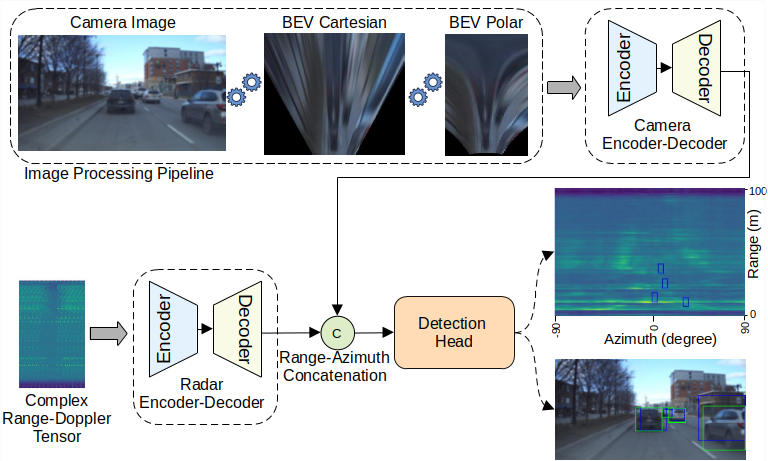
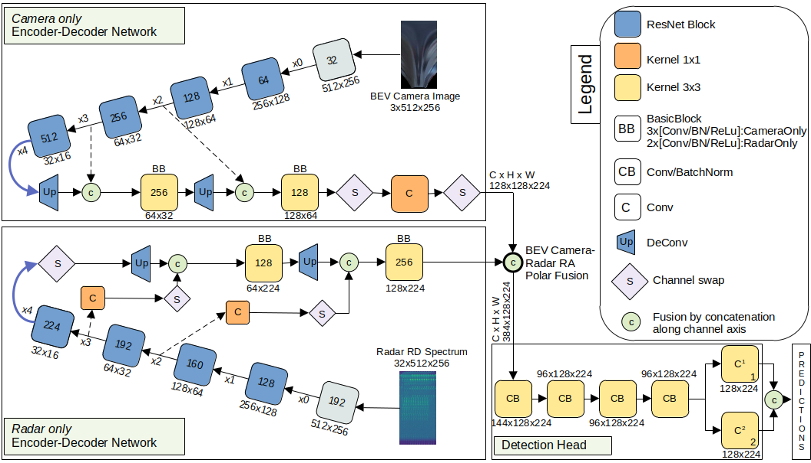

# REFNET: Resource Efficient Fusion Network for Object Detection in Bird’s-Eye View

## News
- **(2024/07/10)** Paper accepted to ITSC 2024!

## Overview
The image processing pipeline first transforms the camera image into Bird’s-Eye View (BEV). Subsequently, the resultant BEV undergoes
conversion into Polar representation, directly mapping to the Range-Azimuth (RA) image. Object detection is performed on RA image features fused with radar features from the radar decoder. The predictions obtained in the RA view are shown in the camera images with ground-truth bounding boxes in green and predictions in blue.

<p align="center">
  
</p> 

## Abstract
Cameras can be used to perceive the environment around the vehicle, while affordable radar sensors are popular in autonomous driving systems as they can withstand adverse weather conditions unlike cameras. However, radar point clouds are sparser with low azimuth and elevation resolution that lack semantic and structural information of scenes, resulting in generally lower radar detection performance. In this work, we directly use the raw range-Doppler (RD) spectrum of radar data, thus avoiding radar signal processing. We independently process camera images within the proposed comprehensive image processing pipeline. Specifically, at first, we transform the camera images to Bird's-Eye View (BEV) Polar domain and extract the corresponding features with our camera encoder-decoder architecture. The resultant feature maps are fused with Range-Azimuth (RA) features, recovered from RD spectrum input from the radar decoder to perform object detection. We evaluate our fusion strategy with other existing methods not only in terms of accuracy, but also on computational complexity.

## Fusion Architecture
The _camera only_ and _radar only_ encoder contains four ResNet-50-like blocks with a pre-encoder block. The features
from each of those blocks are named x0, x1, x2, x3, and x4. The thick blue curved arrow takes the encoder’s output to
the decoder’s input in order to expand the input feature maps to higher resolutions. The dotted lines represent the skip
connections used to preserve spatial information. The features from the _camera only_ decoder and _radar only_ decoder are
then _fused_ before passing them to the detection head. The head finally predicts the objects in Bird’s Eye RA Polar View.

<p align="center">
  
</p>

The models are trained and tested on the [RADIal dataset](https://github.com/valeoai/RADIal/tree/main). The dataset can be downloaded
[here](https://github.com/valeoai/RADIal/tree/main#labels:~:text=Download%20instructions). Under `resources/gen_polarimage`, we provide functions that help in converting front-facing camera images to BEV Cartesian and subsequently to BEV Polar.

## Results
Vehicle detection performances on the RADIal dataset test split. RD, ADC, RPC, RT, C correspond to Range-Doppler, Analog-To-Digital Converter signal, Radar Point Cloud, Range-Time signal, and Camera data respectively. Best
values are in bold and second best are underlined. †: reimplemented with only detection head as they are multi-tasking
models. The missing values are indicated by a ”-”, either due to code unavailability or unreported in the respective works.

|   Model   | AP| AR  | F1  | RE  | AE | # |FPS |&sigma;  |Size |GPU cost|
| :-------: | :------: | :--: | :--: | :--: |  :--: |:--: |:--: |:--: |:--: |:--: |
| FFTRadNet<sup>†</sup> |    93.45 | 83.35| 88.11| <ins>0.12</ins>| 0.15|**3.23**| **68.46**| 2.19| **39.2**| **2.01**|
| TFFTRadNet<sup>†</sup>| 90.80| 88.31| 89.54| 0.15| 0.13| 9.08| 54.37| 4.28| 109.5| <ins>2.04</ins>|
| ADCNet    | 95| 89| 91.9| 0.13| <ins>0.11</ins>| -| -| -| -| -|
| CMS       | <ins>96.9</ins>| 83.49| 89.69| 0.45| -| 7.7| -| -| -| -|
| ROFusion  | 91.13| **95.29**| 93.16| 0.13| 0.21|  <ins>3.33</ins>| 56.11| <ins>1.55</ins>| 87.2| 2.87|
| EchoFusion| **96.95**| <ins>93.43</ins>| **95.16**| <ins>0.12</ins>| 0.18| 25.61| -| -| 102.5| -|
| Ours      | 95.75| 91.35| <ins>93.49</ins>| **0.11**| **0.09**|6.58| <ins>58.91</ins>| **1.28**| <ins>79.8</ins>| 2.06|

- **AP**: Average Precision (%)
- **AR**: Average Recall (%)
- **F1**: F1 Score (%)
- **RE**: Range Error (meters)
- **AE**: Angle Error (degrees)
- **\#**: Number of Parameters (in Millions)
- **FPS**: Frames Per Second: for a given model, a FPS value is computed for each frame in the test set and averaged. 
- **&sigma;**: Standard Deviation computed from FPS values.
- **Size**: Size of the model in MB.
- **GPU cost**: GPU memory consumption while inference in GB.

## Setting up the virtual environment
### Requirements
All the codes are tested in the following environment:
- Linux (tested on Ubuntu 22.04)
- Python 3.9

### Installation
0. Clone the repo and set up the conda environment:
```bash
$ git clone "this repo"
$ conda create --prefix "your_path" python=3.9 -y
$ conda update -n base -c defaults conda
$ source activate "your_path"
```

1. The following are the packages used:
```bash
$ conda install pytorch==1.12.1 torchvision==0.13.1 torchaudio==0.12.1 cudatoolkit=11.3 -c pytorch
$ pip install -U pip
$ pip3 install pkbar
$ pip3 install tensorboard
$ pip3 install pandas
$ pip3 install shapely
$ pip3 install opencv-python
$ pip3 install einops
$ pip3 install timm
$ pip3 install scipy
$ pip3 install scikit-learn
$ pip3 install polarTransform
$ pip3 install matplotlib
$ pip3 install numpy==1.23
```
## Running the code

### Training
Please run the following to train the model. Camera-Radar fusion in BEV for object detection will be chosen by default.
```bash
$ python 1-Train.py
```
### Evaluation
To evaluate the model performance, please load the trained model and run:
```bash
$ python 2-Evaluation.py
```
### Testing
To obtain qualitative results, please load the trained model and run:
```bash
$ python 3-Test.py
```
### Computational complexity
To compute Frames Per Second (FPS), please load the trained model and run:
```bash
$ python 4-FPS.py
```

## Further research
- Even though, we focus only on object detection, there is a scope to include segmentation head in our model, which we leave open to the community or may pursue ourselves.
- We have also proposed an early fusion architecture that intakes camera images and the point cloud data from imaging radar and lidar sensor in perspective view. Our code can be extended for further analysis. All parameters can be found in our configuration file, which is available here: `config/config_allmodality.json`.
- We plan to further accelerate this research using k-radar dataset.
## Acknowledgments
- Thanks to Elektrobit Automotive GmbH and Mobile Perception Systems Lab from Eindhoven University of Technology for their continous support.
- This project is inspired from the codebase from [RADIal](https://github.com/valeoai/RADIal/tree/main).


## License
The repo is released under the BSD 3-Clause License.
